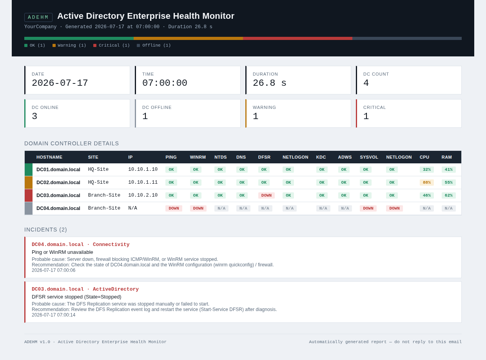

# ADEHM — Active Directory Enterprise Health Monitor

Agentless health monitoring for Active Directory domain controllers.
**Pure PowerShell + CIM/WinRM. No agents, no database, no admin rights.**

ADEHM is the monitoring component of the **AD Enterprise Suite**, a growing
family of Active Directory tooling.

[](https://www.powershellgallery.com/packages/ADEHM)
[](https://www.powershellgallery.com/packages/ADEHM)
[](LICENSE)



## Why ADEHM

Most AD monitoring options are either heavyweight platforms (per-sensor
licensing, agents, databases) or ad-hoc scripts built on legacy WMI/DCOM.
ADEHM sits in between:

- **Agentless** — one CIM session per DC over WinRM, nothing to install on
  the controllers
- **Least privilege by design** — runs with a read-only service account;
  ships with the tooling and the documented delegation map to make that
  work even on **hardened DCs** (security baselines)
- **Auditable** — plain PowerShell you can read, MIT licensed
- **Complete output** — professional HTML report, email delivery with an
  Outlook-safe body rendering, detailed logs, structured incidents with
  probable cause and recommendation

## What it checks

| Category | Checks |
|---|---|
| Availability | Ping, DNS resolution, WinRM, IP, FQDN |
| AD services | NTDS, DNS, DFSR, Netlogon, KDC, ADWS |
| Shares | SYSVOL, NETLOGON |
| System | CPU, RAM, disks (all fixed volumes), uptime, last boot |
| Identity | Server name, Windows version/build, AD site, domain, forest |

Each DC gets an overall status — OK / Warning / Critical / Offline — with
configurable thresholds.

## Quick start

**Option A — PowerShell Gallery (recommended):**

```powershell
Install-Module ADEHM
# Copy the sample config somewhere writable, then adjust DCs/thresholds/SMTP
Copy-Item "$(Split-Path (Get-Module ADEHM -ListAvailable).Path)\Config\ADEHM.config.psd1" C:\ADEHM\my.config.psd1
Start-ADEHM -ConfigPath C:\ADEHM\my.config.psd1 -DemoMode        # dry run, simulated data
Start-ADEHM -ConfigPath C:\ADEHM\my.config.psd1 -Credential (Get-Credential)
```

**Option B — Git clone:**

```powershell
git clone https://github.com/oussangelo/ADEHM.git
cd ADEHM
notepad .\Config\ADEHM.config.psd1     # DCs, thresholds, SMTP
.\Start-ADEHM.ps1 -DemoMode             # dry run, simulated data
.\Start-ADEHM.ps1 -Credential (Get-Credential)
```

Sample output: [example report](Docs/examples/ADEHM_Report_EXAMPLE.html) ·
[example log](Docs/examples/ADEHM_EXAMPLE.log)

## Requirements

- Windows PowerShell 5.1 or PowerShell 7 on a domain-joined host
- WinRM (5985/5986) and ICMP open toward the monitored DCs
- A dedicated, non-admin service account — see the
  [Permissions Guide](Docs/PERMISSIONS.md) for the complete delegation map
  (including hardened environments) and the automation scripts in `Tools/`
- `nltest.exe` on the host for AD site detection (included with RSAT)

## Documentation

- [Installation Guide](Docs/INSTALL.md)
- [Administration Guide](Docs/ADMIN_GUIDE.md)
- [Permissions Guide](Docs/PERMISSIONS.md) — the five delegations, hardened-DC edition
- Deep dive article: [Monitoring Hardened Domain Controllers Without Admin Rights](https://dev.to/oussangelo/monitoring-hardened-domain-controllers-without-admin-rights-the-five-permission-layers-nobody-o3f)
- [Architecture](Docs/ARCHITECTURE.md)
- [Changelog](CHANGELOG.md)

## Roadmap

- v1.1 — AD replication health, FSMO roles, Global Catalog, LDAP/LDAPS
- v1.2 — DNS health, zone checks, aging & scavenging
- v1.3 — Windows event log analysis, critical AD events
- v2.0 — Web dashboard, REST API, execution history

## License

MIT — © 2026 Angelo OUSSATCHEDJI. See [LICENSE](LICENSE).
